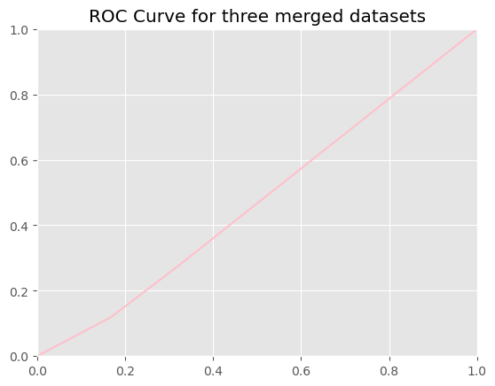

# The Correlation Between Air Quality and Trees

---

## About

---

:max_bytes(150000):strip_icc()/Lead-8ba060bb458d4011a5547edd2ed659c3.jpg)

As a final project we were given the task of creating a question we would like to research. There are plenty of trees of different species that can found all throughout New York. Due to NYC Park's initiative to plant trees along the sidewalks of each bourough, I had to wonder if the increase in trees made a positive correlation with the air quality. Therefore, I wanted to dedicate an exploratory data analysis project towards this topic.

## Libraries

---

* Pandas
* Matplotlib
* Numpy
* Seaborn
* sklearn

## Data

---

The three datasets used were taken from NYC's Open Data:

* [airquality](https://data.cityofnewyork.us/Environment/Air-Quality/c3uy-2p5r/about_data)
* [tree_2005](https://data.cityofnewyork.us/Environment/2005-Street-Tree-Census/29bw-z7pj/about_data)
* [tree_2015](https://data.cityofnewyork.us/Environment/2015-Street-Tree-Census-Tree-Data/uvpi-gqnh/about_data)

#### Data Cleaning

Tailored the data to my research question with the Panda library to clean the data by removing duplicates and blank rows, changing column names, and merging airquality with tree_2005 and airquality with tree_2005 so the correlation and hypothesis testing would occur smoothly. Afterwards I replaced the duplicated and missing vales from the 2015 tree dataset with the most frequent values using sklearn's Simple Imputer library.

The air quality dataset had many outliers, so I used the IQR method to find where they were placed, then I removed them using the upper limit and lower limit. Since most of my data from the tree data were objects or categories, I used One Hot Encoding instead of integer encoding to reduce the amount of bias to prevent inaccurate predictions. Then, to determine if there wa a relationship between the tree datasets,

#### Data Analysis

Then, I utilized the Kolmogorov-Smirnov test to not make assumptions about the underlying distribution of the data; instead, I wanted to determine whether each health status of health_Fair, health_Poor, and health_Good for each merged dataset were different from each other.

Afterwards with Pandas's correlation function I determined with there was a relationship between each datasets. Based on the results I concluded that there was not a linear relationsip between both datasets; so I wanted to complete model validation to know whether the model fit the data properly.

Using linear regression to find the Mean Squared Error and R-squared values I found the mean sqaure errot to tbe larger than the R-squared value, so the null hypothesis was not rejected. Additonally with logistic regression, the model was perfectly diagonal, so the plot was classified as not accurate and closer to a false positive rate.

|  |  |
| ---------------------------------------------- | ---------------------------------------------- |

## Results

---

There is not a linear relationship between both datasets, so the null hypothesis was not rejected.

## Conclusion

---

The null hypothesis could not be rejected from the tests and distributions of values. The lack of correlation between the three datasets makes me question if the amount of variables I had in my datasets was enough to reach a fruitful conclusion. If I redo this project, I would make my hypothesis explore how the number of trees affects the air quality and the health of NYC's population.

